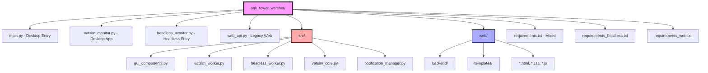
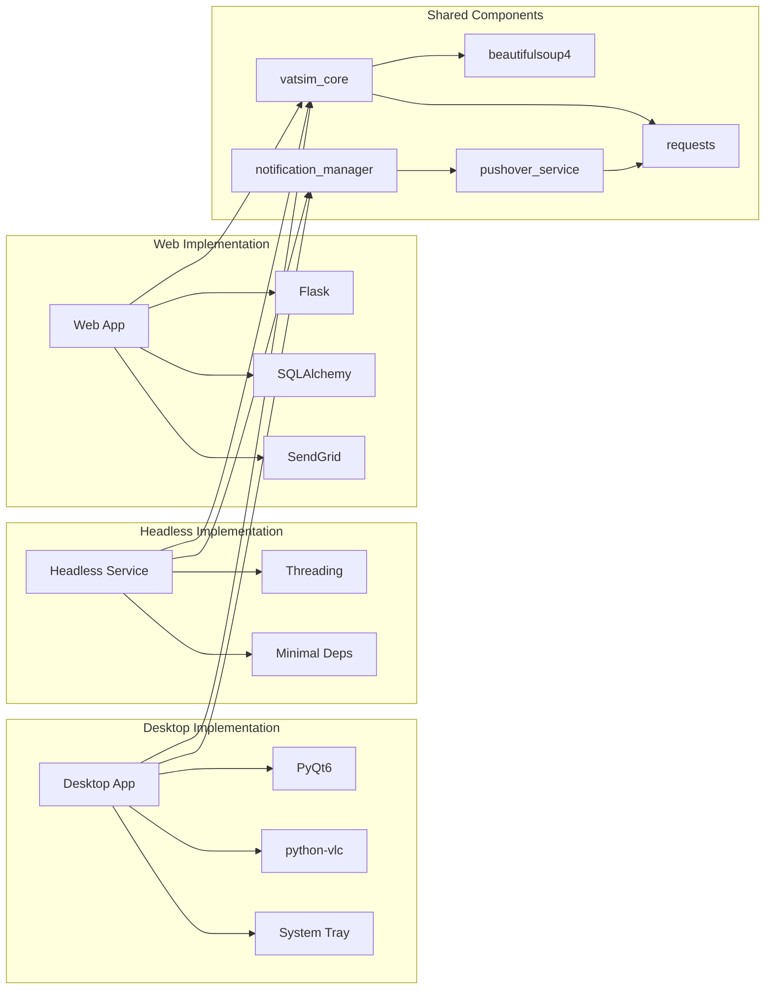
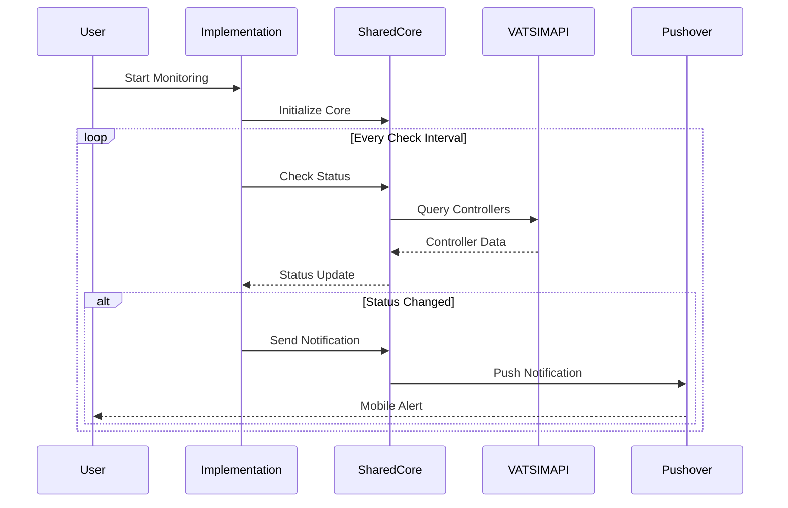
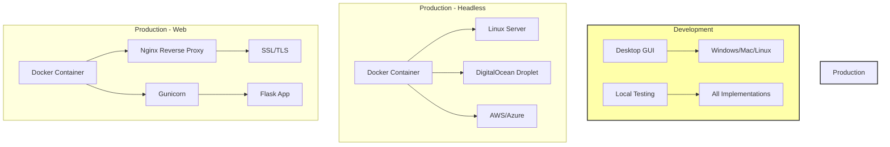
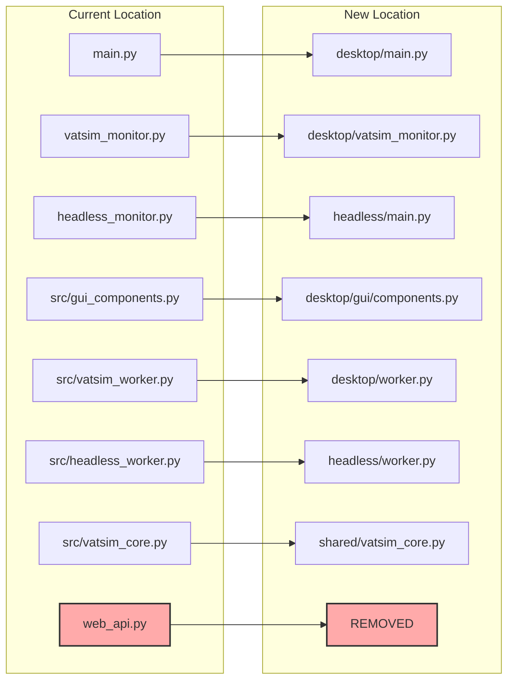
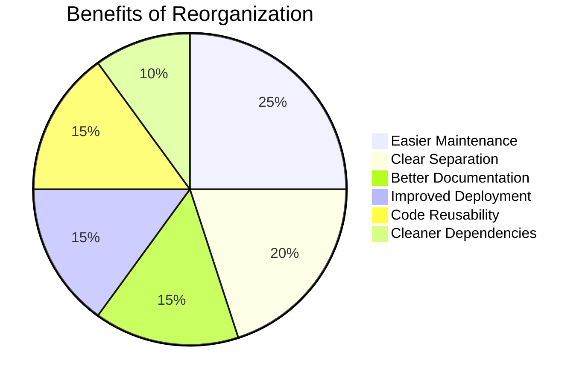

# Oak Tower Watcher - Architecture Diagram

## Current vs Proposed Structure

### Current Structure (Mixed Implementation)


### Proposed Structure (Clean Separation)

```mermaid
graph TD
    A[oak_tower_watcher/] --> B[desktop/]
    A --> C[headless/]
    A --> D[web/]
    A --> E[shared/]
    A --> F[config/]
    A --> G[assets/]
    A --> H[scripts/]
    A --> I[docs/]
    
    B --> B1[main.py]
    B --> B2[vatsim_monitor.py]
    B --> B3[gui/components.py]
    B --> B4[worker.py]
    B --> B5[requirements.txt]
    
    C --> C1[main.py]
    C --> C2[worker.py]
    C --> C3[requirements.txt]
    C --> C4[Dockerfile]
    
    D --> D1[backend/]
    D --> D2[templates/]
    D --> D3[static/]
    D --> D4[requirements.txt]
    D --> D5[Dockerfile]
    
    E --> E1[vatsim_core.py]
    E --> E2[notification_manager.py]
    E --> E3[pushover_service.py]
    E --> E4[utils.py]
    
    style A fill:#9f9,stroke:#333,stroke-width:4px
    style B fill:#faa,stroke:#333,stroke-width:2px
    style C fill:#aaf,stroke:#333,stroke-width:2px
    style D fill:#afa,stroke:#333,stroke-width:2px
    style E fill:#ffa,stroke:#333,stroke-width:2px
```


## Implementation Dependencies



## Data Flow Architecture



## Deployment Architecture



## File Migration Map



## Benefits Visualization



## Implementation Timeline

```mermaid
gantt
    title Reorganization Timeline
    dateFormat  YYYY-MM-DD
    section Phase 1
    Create Directory Structure    :a1, 2025-01-06, 1d
    Create README Files          :a2, after a1, 1d
    
    section Phase 2
    Move Desktop Implementation  :b1, after a2, 1d
    Update Desktop Imports       :b2, after b1, 1d
    
    section Phase 3
    Move Headless Implementation :c1, after b2, 1d
    Update Headless Imports      :c2, after c1, 1d
    
    section Phase 4
    Reorganize Web Implementation :d1, after c2, 1d
    Update Web Imports           :d2, after d1, 1d
    
    section Phase 5
    Move Shared Components       :e1, after d2, 1d
    Update All Import Paths      :e2, after e1, 1d
    
    section Phase 6
    Update Docker Files          :f1, after e2, 1d
    Update Scripts              :f2, after f1, 1d
    
    section Phase 7
    Update Documentation         :g1, after f2, 1d
    Final Testing               :g2, after g1, 2d